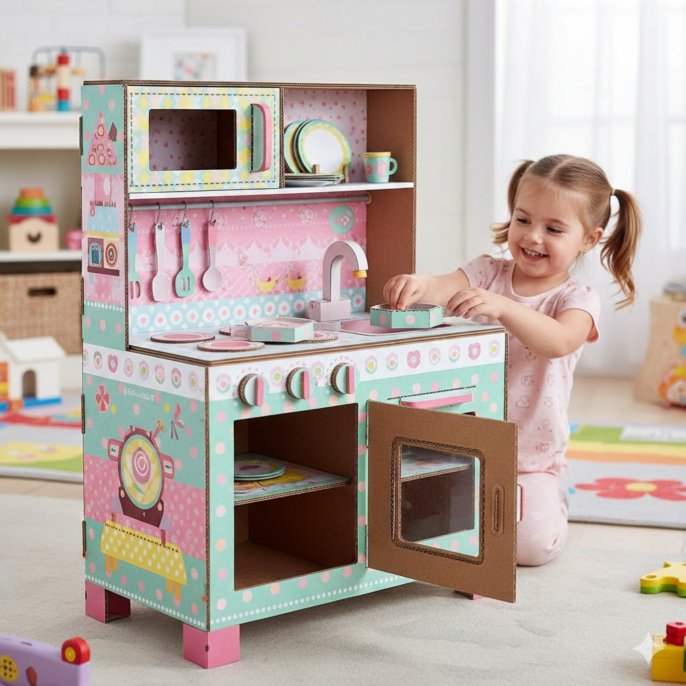

- [[VPS]]
	- ssh root@n8n.lemonsushi.com
	- ssh root@144.91.111.204
- [[Lenticular]] I just found that currently there is not enough technology to do this project currently, we are heading in to the right direction, the problem is from a picture generate a 3d image, it would be possible if the object in 3D is no the photo, the photo is slightly 3D but all around is 3D instead. but for the full picture we need multiple cameras.
- [[Kitchen Cardboard]]
	- Image of a reference
	  collapsed:: true
		- 
	-